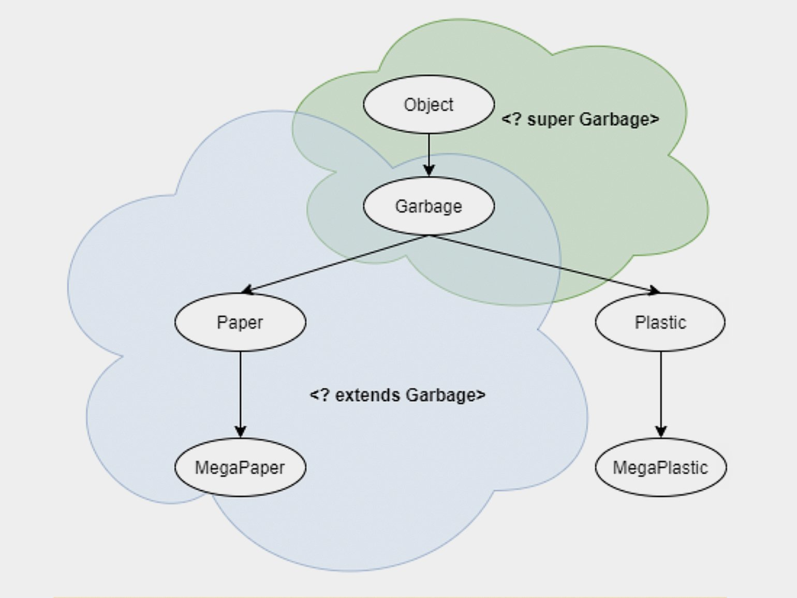

## _Статические поля и методы_
***

СТАТИК - одно значение на ВСЕ экземпляры данного класса

    public static String StartLocation;

меняешь у базового - меняется у ВСЕХ наследников. 
Если поменять через один из наследников - будет изменено у всех наследников.
Доступ к полю обычно через название родительского класса - Character.StartLocation
может использоваться, например, для подсчёта ВСЕХ СОЗДАННЫХ героев - счётчик будет
ОБЩИЙ НА ВСЕ созданные экземпляры родительского класса

статический ИНИЦИАЛИЗАТОР поля или полЕЙ:
    
    static {
        StartLocation = "Talking Island";
    }

 Со СТАТИЧЕСКИМИ полями должны работать СТАТИЧЕСКИЕ методы.
 НЕстатические методы не могут быть вызваны из СТАТИЧЕСКИХ.
 Для СТАТИКИ нет иерархии - для вызывания статических полей и методов
 не нужно писать THIS или SUPER (статическое поле не принадлежит какому-то текущему 
 экземпляру класса).
 ТО ЕСТЬ обращение к статичесеким полям/методам происходит из базового класса,
 а не из его экземпляров.

при этом можно выбрать как видимость в текущем классе, так и видимость для 
экземпляров класса (дочерних, наследников)
    
    public    - доступность ВСЕМ и ВЕЗДЕ
    protected - доступность данному классу и его наследникам
    private   - недоступность только внутри текущего класса

использование СТАТИКИ можно обойти разными способами. если без неё можно - 
лучше обойтись

## _Абстрактные классы и методы_
***

        public abstract class BaseCharacter {}

public abstract class - АБСТРАКТНЫЙ КЛАСС. не даёт создавать экземпляры самого себя
и служит только РОДИТЕЛЕМ для других классов, являясь для них схемой и реализацией
по умолчанию

В абстарктном классе могут быть абстрактные методы БЕЗ реализации.

    public abstract void die()

При этом в логику абстрактного класса эти методы могут быть включены (несмотря на
то, что метод объявлен, но не реализован, его вызов может быть сделан из соседних
методов).


Реализация таких абстрактных методов должны быть ОБЯЗАТЕЛЬНОЙ для всех НАСЛЕДНИКОВ
абстр класса
иначе программа не скомпилируется


## _Наследование_
***
    
    class Foo{}
    
    class Doo extends Foo{}
    
так класс Doo является наследником класса Foo (Doo расширяет класс Foo)

    BASE HERO  - базовый класс
    
    DRUID      - наследуется от BASE HERO

    public abstract class BaseHero{}
    public class Druid extends BaseHero{}
    public class Dwarf extends Druid{}

    BaseHero dwarf = new Dwarf();

даункаст: если от BaseHero уходить в Druid    
если нужно подняться по иерархии вверх - АпКаст (друида можно представить 
в виде экземпляра класса BaseHero)
    
    DWARF      - наследуется от DRUID (даункаст от Druid)

Если создать экземпляр класса DRUID, то его нельзя привести к типу DWARF 
(нельзя сделать даункаст
без предварительного апкаста - НЕПОНЯТНО)

НО
экземпляр класса DWARF можно АпКастить до класса DRUID и, если необходимо, 
до класса BASE HERO

При вызывании конструктора класса наследника (2е поколение)
1. Сначала вызываются все его собственные констуркторы по мере необходимости. 
Если в них использовался конструктор SUPER(), то...
2. Затем вызывается конструктор класса-родителя (класс 1го поколения), 
и если в нём использовался конструктор SUPER базового класса, то 
3. В конце концов вызывается конструктор БАЗОВОГО класса (0-е поколение).
4. Затем курсор выполнения процесса возвращается по восходящей 
к классу 2го поколения, выполняя по ходу все действия во всех конструкторах 
на пути - как в рекурсии (возвращение по стеку вызовов)

Alt + Insert -> Constructor

## _Интерфейсы_
***

`Interface` предназначен для описания исключительно общего поведения сущностей.

> Частный случай: для гарантии, реализации некоторого
поведения.

**Интерфейс** – это частный случай класса. Он представляет собой полностью абстрактный
класс с абстрактными членами.

## _ОБОБЩЕНИЯ_

У нас в парадной подъезде рядом с почтовыми ящиками стоит коробка. Предполагалось, что 
туда будут выбрасывать бумажный спам, который какие-то вредители упорно кладут в эти 
самые ящики. Но в коробке вместе с бумажками лежат пустые бутылки и банки, подозрительного 
вида пакеты, а в нынешних реалиях — ещё и использованные медицинские маски. Почему люди 
так делают? Потому что так можно.

Теперь представьте, что содержимое коробки вы отвозите на переработку, а перед 
этим каждый раз приходится отделять бумагу от прочего мусора. Не хотели бы вы заполучить 
такую коробку, которая не даст положить в себя что-то, кроме бумаги? Если ваш ответ «да» 
— вам понравятся дженерики (**_generics_**).

### Объявляем дженерик-классы и создаём их экземпляры

---------

Давайте запрограммируем ту самую коробку, о которой шла речь в начале статьи: 
создадим класс Box, который умеет работать только с элементами определённого типа. 
Пусть для простоты в этой коробке пока будет только один элемент:

```java
class Box<T> { // обозначение типа - T
    // переменная с типом T
    private T item;

    public void putItem(T item) { //параметр метода типа T
    this.item = item;
    }  

    public T getItem() { // возвращает объект типа T
    return item;
    }
}
```
В классе два метода:

* первый добавляет элемент в коробку;
* второй достаёт его обратно и возвращает пользователю.
Во всех случаях, кроме заголовка класса, символ `T` пишется без угловых скобок, 
* он обозначает один и тот же параметр типа.

Параметром типа для дженерика может быть только ссылочный тип, интерфейс или 
перечисление (enum). Примитивные типы и массивы с дженериками не используются, 
то есть нельзя создать `Box<int>` или `Box<int[]>`, но можно — `Box<Integer>` или 
`Box<List<Integer>>`.

Теперь создадим коробку для бумаги. Пусть за бумагу отвечает класс Paper, а значит, 
экземпляр правильной коробки создаётся вот так:

```java
class Paper {}
Box<Paper> boxForPaper = new Box<Paper>();
```

Это полный вариант записи, но можно и короче:

```java
Box<Paper> boxForPaper = new Box<>();
```

Так как слева мы уже показали компилятору, что нужна коробка именно для бумаги, 
справа можно опустить повторное упоминание Paper — компилятор «догадается» о нём сам.

Это «угадывание» называется **_type inference_** — выведение типа, а оператор «<>» — 
это `diamond operator`. Его так назвали из-за внешнего сходства с бриллиантом.

Для обозначения дженерик-типа в классе Box мы использовали латинскую букву `T`. 
Это необязательно, то есть можно было бы использовать любую другую букву или даже слово 
— `Box<MyType>`. Тем не менее есть набор рекомендаций от Oracle о том, когда какие 
обозначения лучше использовать в дженериках. Вот они:

>E — element, для элементов параметризованных коллекций;
>
>K — key, для ключей map-структур;
>
>V — value, для значений map-структур;
>
>N — number, для чисел;
>
>T — type, для обозначения типа параметра в произвольных классах;
>
>S, U, V и так далее — применяются, когда в дженерик-классе несколько параметров.

Дженерик-классы хороши своей универсальностью: с классом Box теперь можно создать не 
только коробку для бумаги, но и, например, коробки для сбора пластика или стекла:

```java
class Plastic {}
class Glass {}
Box<Plastic> boxForPlastic = new Box<>();
Box<Glass> boxForGlass = new Box<>();
```
А можно пойти ещё дальше и создать дженерик-класс с двумя параметрами для коробки 
с двумя отсеками. Вот так:

```java
class TwoCellsBox<T, S> {
private T firstCellItem;
private S secondCellItem;
//...
}
```

Теперь легко запрограммировать коробку, в одном отсеке которой будет собираться пластик, 
а во втором — стекло:

```java
TwoCellsBox<Plastic, Glass> plasticGlassBox 
        = new TwoCellsBox<>();
```

Обратите внимание, что type inference и diamond operator позволяют нам опустить 
оба параметра в правой части.

### Объявляем и реализуем дженерик-интерфейсы

-------

Объявление дженерик- интерфейсов похоже на объявление дженерик-классов. Продолжим 
тему переработки и создадим интерфейс пункта переработки `GarbageHandler` сразу с двумя 
параметрами: тип мусора и способ переработки:

```java
interface GarbageHandler<T, S> {
void handle(T what, S how);
}
```

Реализовать (имплементить) этот интерфейс можно в обычном, не дженерик- классе:

```java
class MyPaperHandleMethod {}


class MyNonGenericPaperHandler implements 
        GarbageHandler<Paper, MyPaperHandleMethod> {
    
    @Override
    public void handle(Paper what, MyPaperHandleMethod how) {
        // здесь что-то делается с бумажным мусором 
        // способом MyPaperHandleMethod    
    }
}
```

Но можно пойти другим путём и сначала объявить дженерик-класс с двумя параметрами:

```java
class GarbageHandlerImpl<T, S> implements GarbageHandler<T, S> {
    @Override
    public void handle(T what, S how) {
    // здесь что-то делается с мусором типа T способом S
    }
}
```
Или скомбинировать эти два способа и написать дженерик-класс только с одним параметром:

```java
class PaperHandler<T> implements GarbageHandler<Paper, T> {
    @Override
    public void handle(Paper what, T how) {
    // здесь что-то делается с бумагой способом T   
    }
}
```

>_**Дженерик-классы**_ и _**дженерик-интерфейсы**_ вместе называются _**дженерик-типами**._

Можно создавать экземпляры дженерик-типов «без расшифровки», то есть никто не запретит 
вам объявить переменную типа `Box` — просто `Box`:

```java
Box box = new Box<>();
```

Для такого случая даже есть термин — `raw type`, то есть «сырой тип». 
Эту возможность оставили в языке для совместимости со старым кодом, который был написан 
до появления дженериков.

В новых программах так писать не рекомендуется. Да и зачем? Ведь при таком способе 
теряются все преимущества использования дженериков.

### Пишем дженерик-методы

-------

В примерах выше мы уже видели параметризованные методы в дженерик-классах и интерфейсах. 
Типизированными могут быть как параметры метода, так и возвращаемый тип.

До этого мы использовали в методах только те обозначения типов, которые объявлены 
в заголовке дженерик-класса или интерфейса, но это не обязательно. Предположим, у 
нашего пункта переработки есть ещё опция: сбор опасных отходов, которые сотрудники вывозят 
на утилизацию в другое место. Напишем метод для этого:

```java
interface GarbageHandler<T, S> {
void handle(T what, S how);

   <E> void transfer(E dangerousWaste);
}
```

У метода `transfer` есть свой личный параметр для типа, который не обязан совпадать ни с 
`T`, ни с типом `S`. При первом упоминании новый параметр, как и в случае с заголовком 
класса или интерфейса, пишется в угловых скобках.

Дженерик-методы можно объявлять и в обычных (не дженерик) классах и интерфейсах. 
Наш класс для переработки мог быть выглядеть так:

```java
class GarbageHandlerImpl {

    public <T, S> void handle(T what, S how) {
        // здесь что-то делается с мусором типа T способом S
    }
}
```

Здесь дженерики используются только в методе.

>Обратите внимание на синтаксис: параметры типов объявляются после модификатора доступа 
(`public`), но перед возвращаемым типом (`void`). Они перечисляются через запятую в общих 
угловых скобках.

Ограничиваем дженерики сверху и снизу
Давайте немного расширим наше представление о мусоре и введём для него дополнительное 
свойство — массу «типичного представителя», то есть массу одной пластиковой бутылки 
или листка бумаги, например.

```java
abstract class Garbage{
public abstract double getWeight(){}

class Paper extends Garbage{
    @Override
    public double getWeight() {
        return 0.01;
    }
}

class Plastic extends Garbage{
    @Override
    public double getWeight() {
        return  0.3;
    }
}
```

Теперь попробуем использовать эту массу в методе уже знакомого класса `Box`:

```java
class Box<T> {

    private T item;

    public double getItemWeight() {
        // не скомпилируется
        return item == null ? 0 : item.getWeight();
    }

    //... остальные методы
}
```

И получим ошибку при компиляции: мы не рассказали компилятору, что `T` — это какой-то 
вид мусора. Исправим это с помощью так называемого **_upper bounding_** — ограничения сверху:

```java
class Box<T extends Garbage> {
    // методы класса
}
```

Теперь метод `getItemWeight` успешно скомпилируется.

Здесь `T extends Garbage` означает, что в качестве T можно подставить Garbage или 
любой класс-наследник `Garbage`. Из уже известных нам классов это могут быть, например, 
`Paper` или `Plastic`. Так как и у Garbage, и у всех его наследников есть метод `getWeight`, 
его можно вызывать в новой версии дженерик-класса `Box`.

Для одного класса или интерфейса можно добавить сразу несколько ограничений. 
Вспомним про интерфейс для пункта приёма мусора и введём класс для метода переработки 
— `HandleMethod`. Тогда `GarbageHandler` можно переписать так:

```java
class HandleMethod {
}

interface GarbageHandler<T extends Garbage, S extends HandleMethod> {
    void handle(T what, S how);
}
```

>В качестве границы может выступать класс, интерфейс или перечисление (`enum`), но 
не примитивный тип и не массив. При этом для интерфейсов тоже используется слово 
`extends`, а не `implements`: `<T extends SomeInterface>` вместо `<T implements SomeInterface>`.

### Wildcards

-------------

До этого мы использовали для параметров типов буквенные имена, но в Java есть и 
специальный символ для обозначения неизвестного типа — «?». Его принято называть 
**_wildcard_**, дословно — «дикая карта».

> Термин **_wildcard_** пришёл в программирование из карточной игры. 
В покере, например, так называют карту, которая может сыграть вместо любой другой. 
Джокер — известный пример такой «дикой карты».

**_Wildcard_** нельзя подставлять везде, где до этого мы писали буквенные обозначения. 
Не получится, например, объявить класс Box<?> или дженерик-метод, который принимает 
такой тип:

```java
class Box<?>{ // не скомпилируется       
   ? variable;  // не скомпилируется
   public <?> void someMethod(? param){ // не скомпилируется
//...   
}
}
```

**_Wildcards_** удобно использовать для объявления переменных и параметров методов 
совместно с классами из _Java Collection Framework_ — здесь собраны инструменты Java 
для работы с коллекциями. Если вы не очень хорошо знакомы с ними, освежите знания, 
прочитав эту статью.

В примере ниже мы можем подставить вместо «?» любой тип, в том числе `Paper`, 
поэтому строка успешно скомпилируется:

```java
List<?> example1 = new ArrayList<Paper>();
```

Wildcards можно применять для ограничений типов:

```java
List<? extends Garbage> example2 = new ArrayList<Paper>();
```

Это уже знакомое нам ограничение сверху, **_upper bounding_**, — вместо «?» допустим Garbage 
или любой его класс-наследник, то есть `Paper` подходит.

Но можно ограничить тип и снизу. Это называется **_lower bounding_** и выглядит так:

```java
List<? super Garbage> example3 = new ArrayList<Garbage>();
```

Здесь `<? super Garbage>` означает, что вместо «?» можно подставить `Garbage` или любой 
класс-предок `Garbage`. Все ссылочные классы неявно наследуют класс `Object`, так что в 
правой части ещё может быть `ArrayList<Object>`.


Множества допустимых классов при использовании ограниченных **_wildcards_**. 



### Собираем понятия, связанные с дженериками

-------

Мы не успели разобраться с более сложными вещами — например, с заменами аргументов типов в классах-наследниках, с переопределением дженерик-методов, не узнали об особенностях коллекций с wildcards.

Обо всём этом и не только — в следующих статьях. А пока соберём небольшой словарик из терминов, которые связаны с использованием дженериков, — они пригодятся при чтении специальной литературы:

|                   Термин                    |                                            	Расшифровка                                                             |
|:-------------------------------------------:|:-------------------------------------------------------------------------------------------------------------------:|
|        Дженерик-типы (generic types)        |                Дженерик-класс или дженерик-интерфейс с одним или несколькими параметрами в заголовке                |
| Параметризованный тип (parameterized types) |          Вызов дженерик-типа. Для дженерик-типа List<E> параметризованным типом будет, например, List<Box>          |
|       Параметр типа (type parameter)        |                    Используются при объявлении дженерик-типов. Для Box<T> T — это параметр типа                     |
|        Аргумент типа (type argument)        | Тип объекта, который может использоваться вместо параметра типа. Например, для Box<Paper> Paper — это аргумент типа |
|                  Wildcard                   |                                     Обозначается символом «?» — неизвестный тип                                     |
|  Ограниченный wildcard (bounded wildcard)   |               Wildcard, который ограничен сверху — <? extends Garbage> или снизу — <? super Garbage>                |
|            Сырой тип (raw type)             |                       Имя дженерик-типа без аргументов типа. Для List<E> сырой тип — это List                       |